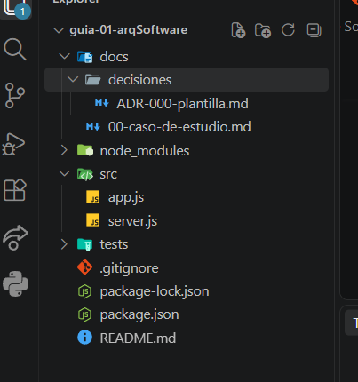
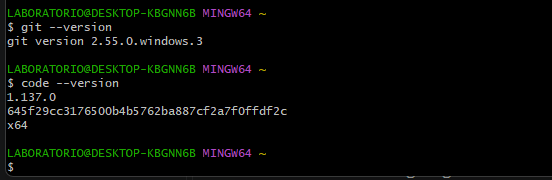

# Guía 01 - Arquitectura de Software

## Datos del estudiante

**Nombre completo:** JUAN JOSE FLORES ANTEZANA

**Curso:** Arquitectura de Software

**Docente:** Ing. Lizbeth Jaico Quispe

**Semestre:** 2026-II

---

## Descripción del curso

El curso de Arquitectura de Software permite comprender cómo se
organiza y estructura un sistema de software, considerando sus
componentes, responsabilidades y relaciones.

Durante el curso se estudiarán decisiones arquitectónicas,
organización del código, patrones y buenas prácticas para desarrollar
sistemas mantenibles, escalables y de calidad.

---

## Expectativas del estudiante

Mis expectativas respecto al curso son fortalecer mis conocimientos
sobre arquitectura de software y aprender a tomar decisiones
arquitectónicas adecuadas durante el desarrollo de sistemas.

También espero aplicar buenas prácticas de diseño, organización del
código, control de versiones y trabajo colaborativo utilizando
herramientas como Git y GitHub.

---

## Estructura del proyecto

El proyecto se encuentra organizado de la siguiente manera:

- **docs/**: documentación del proyecto y decisiones arquitectónicas.
- **src/**: código fuente de la aplicación.
- **tests/**: pruebas del sistema.
- **.gitignore**: especifica los archivos y carpetas que no deben
  subirse al repositorio.
- **README.md**: documentación principal del proyecto.

---

## Evidencias

### Paso 01: Verificación del entorno

### Paso 02: Estructura del proyecto

